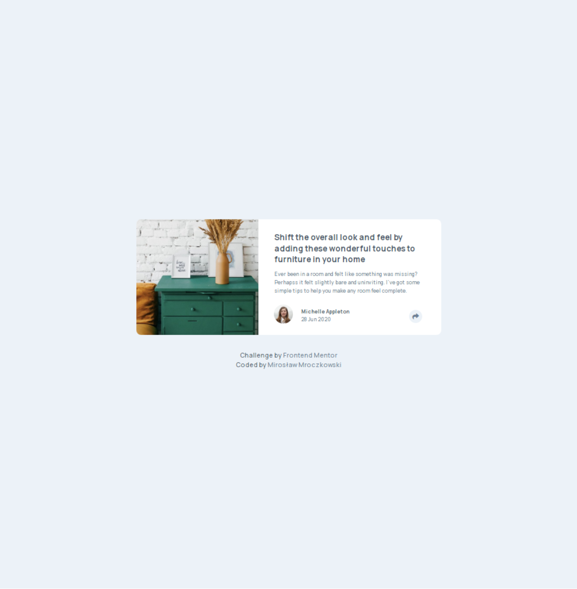
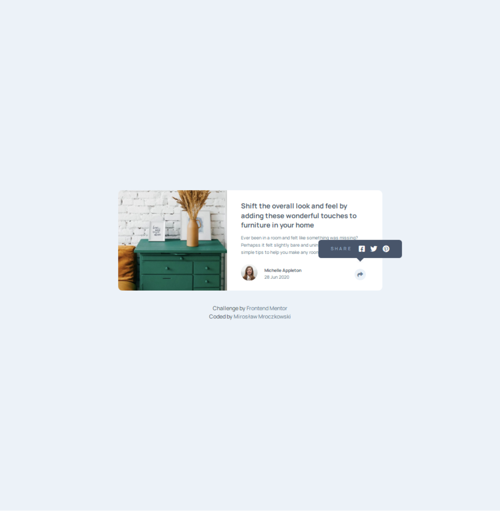
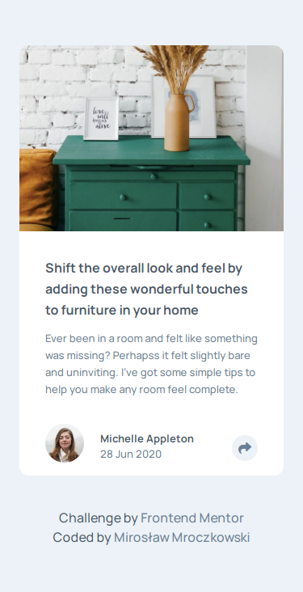
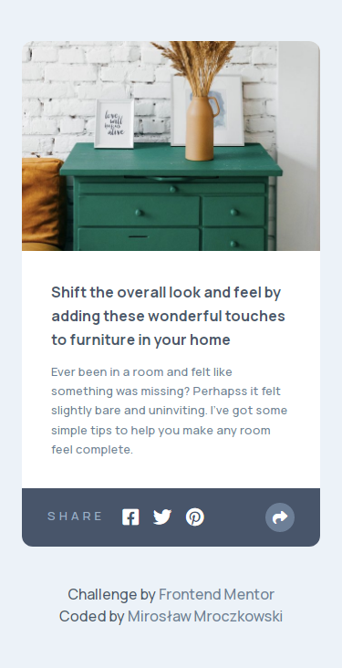

# Frontend Mentor - Article preview component

## Welcome! 👋

This is a solution to the [Article preview component challenge on Frontend Mentor](https://www.frontendmentor.io/challenges/article-preview-component-dYBN_pYFT). Frontend Mentor challenges help you improve your coding skills by building realistic projects.

## Table of contents

- [Overview](#overview)
  - [The challenge](#the-challenge)
  - [Screenshot](#screenshot)
  - [Links](#links)
- [My process](#my-process)
  - [Built with](#built-with)
- [Author](#author)

**Note: Delete this note and update the table of contents based on what sections you keep.**

## Overview

### The challenge

Users should be able to:

- View the optimal layout for the component depending on their device's screen size
- See the social media share links when they click the share icon

### Screenshot

### Links

- Solution URL: [Code](https://github.com/FrontEndMentor-MyChallanges/n_article-preview-component)
- Live Site URL: [Live](https://frontendmentor-mychallanges.github.io/n_article-preview-component/)

## My process

### Built with

- Semantic HTML5 markup
- Tailwind CSS
- Flexbox
- Mobile-first workflow

## Author

- Frontend Mentor - [@miroslaw-mroczkowski](https://www.frontendmentor.io/profile/miroslaw-mroczkowski)
